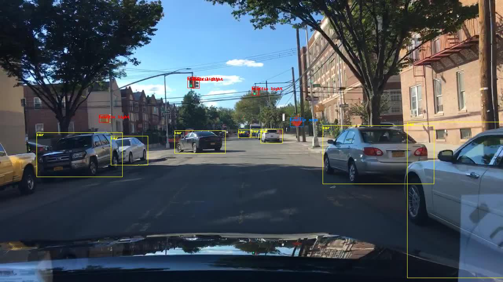

# YOLO V3 for ROS: Real-Time Object Detection for ROS

## Overview

This is a ROS package developed for object detection in camera images. You only look once (YOLO) is a state-of-the-art, real-time object detection system. In the following ROS package you are able to use YOLO on GPU and CPU. The pre-trained model of the convolutional neural network is able to detect pre-trained classes including the data set from VOC, COCO and BDD100K dataset. 
For more information about YOLO, Darknet, available training data and training YOLO see the following link: [YOLO: Real-Time Object Detection](http://pjreddie.com/darknet/yolo/).

The YOLO packages have been tested under ROS Kinetic and Ubuntu 16.04.

Thanks to the original author:Author: [Marko Bjelonic](https://sites.google.com/site/bjelonicmarko/). I have to say sorry as I did not fork that repo because the submodule [darknet](https://github.com/zhanghanduo/darknet) has been modified.



## Citing

The YOLO V3 methods used in this software are described in the paper: 

```
@article{yolov3,
	title={YOLOv3: An Incremental Improvement},
	author={Redmon, Joseph and Farhadi, Ali},
	journal = {arXiv},
	year={2018}
}
```

## Installation

### Dependencies

This software is built on the Robotic Operating System ([ROS]), which needs to be [installed](http://wiki.ros.org) first. Additionally, YOLO for ROS depends on following software:

- [OpenCV](http://opencv.org/) (computer vision library),
- [boost](http://www.boost.org/) (c++ library),

### Building

In order to install darknet_ros, clone the latest version using SSH (see [how to set up an SSH key](https://confluence.atlassian.com/bitbucket/set-up-an-ssh-key-728138079.html)) from this repository into your catkin workspace and compile the package using ROS.

    cd catkin_workspace/src
    git clone --recursive git@github.com:zhanghanduo/cubicle_detect.git
    cd ../

To maximize performance, make sure to build in *Release* mode. You can specify the build type by setting

    catkin_make -DCMAKE_BUILD_TYPE=Release

or using the [Catkin Command Line Tools](http://catkin-tools.readthedocs.io/en/latest/index.html#)

    catkin build darknet_ros -DCMAKE_BUILD_TYPE=Release

We recommend you to use an Nvidia GPU and you'll have to install CUDA (CUDNN is recommended).
The CMakeLists.txt file automatically detects if you have CUDA&CUDNN installed or not.
If you are compiling with CUDA, you might receive the following build error:

    nvcc fatal : Unsupported gpu architecture 'compute_61'.

This means that you need to check the compute capability (version) of your GPU. You can find a list of supported GPUs in CUDA here: [CUDA - WIKIPEDIA](https://en.wikipedia.org/wiki/CUDA#Supported_GPUs). Simply find the compute capability of your GPU and add it into darknet_ros/CMakeLists.txt. Simply add a similar line like

    -O3 -gencode arch=compute_62,code=sm_62

### Download weights

The yolo3.weights is downloaded automatically in the CMakeLists.txt file. If you need to download them again, go into the weights folder and download the pre-trained weights from the COCO data set:

    cd catkin_workspace/src/darknet_ros/darknet_ros/yolo_network_config/weights/
    wget http://pjreddie.com/media/files/yolov3.weights

### Use your own detection objects

In order to use your own detection objects you need to provide your weights and your cfg file inside the directories:

    catkin_workspace/src/darknet_ros/darknet_ros/yolo_network_config/weights/
    catkin_workspace/src/darknet_ros/darknet_ros/yolo_network_config/cfg/

In addition, you need to create your config file for ROS where you define the names of the detection objects. You need to include it inside:

    catkin_workspace/src/darknet_ros/darknet_ros/config/

Then in the launch file you have to point to your new config file in the line:

    <rosparam command="load" ns="darknet_ros" file="$(find darknet_ros)/config/your_config_file.yaml"/>

### Unit Tests

Run the unit tests using the [Catkin Command Line Tools](http://catkin-tools.readthedocs.io/en/latest/index.html#)

    catkin build darknet_ros --no-deps --verbose --catkin-make-args run_tests

You will see the image above popping up.

## Basic Usage

In order to get YOLO ROS: Real-Time Object Detection for ROS to run with your robot, you will need to adapt a few parameters. It is the easiest if duplicate and adapt all the parameter files that you need to change from the `darkned_ros` package. These are specifically the parameter files in `config` and the launch file from the `launch` folder.

## Nodes

### Node: darknet_ros

This is the main YOLO ROS: Real-Time Object Detection for ROS node. It uses the camera measurements to detect pre-learned objects in the frames.

### ROS related parameters

You can change the names and other parameters of the publishers, subscribers and actions inside `darkned_ros/config/ros.yaml`.

#### Subscribed Topics

* **`/camera_reading`** ([sensor_msgs/Image])

    The camera measurements.

#### Published Topics

* **`object_detector`** ([std_msgs::Int8])

    Publishes the number of detected objects.

* **`bounding_boxes`** ([darknet_ros_msgs::BoundingBoxes])

    Publishes an array of bounding boxes that gives information of the position and size of the bounding box in pixel coordinates.

* **`detection_image`** ([sensor_msgs::Image])

    Publishes an image of the detection image including the bounding boxes.

#### Actions

* **`camera_reading`** ([sensor_msgs::Image])

    Sends an action with an image and the result is an array of bounding boxes.

### Detection related parameters

You can change the parameters that are related to the detection by adding a new config file that looks similar to `darkned_ros/config/yolo.yaml`.

* **`image_view/enable_opencv`** (bool)

    Enable or disable the open cv view of the detection image including the bounding boxes.

* **`image_view/wait_key_delay`** (int)

    Wait key delay in ms of the open cv window.

* **`yolo_model/config_file/name`** (string)

    Name of the cfg file of the network that is used for detection. The code searches for this name inside `darkned_ros/yolo_network_config/cfg/`.

* **`yolo_model/weight_file/name`** (string)

    Name of the weights file of the network that is used for detection. The code searches for this name inside `darkned_ros/yolo_network_config/weights/`.

* **`yolo_model/threshold/value`** (float)

    Threshold of the detection algorithm. It is defined between 0 and 1.

* **`yolo_model/detection_classes/names`** (array of strings)

    Detection names of the network used by the cfg and weights file inside `darkned_ros/yolo_network_config/`.
