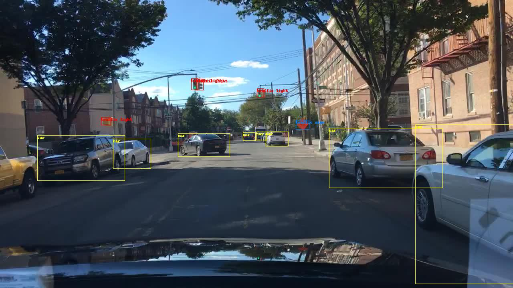

.. Cubicle Detection documentation master file, created by
   sphinx-quickstart on Fri Aug  2 15:02:01 2019.
   You can adapt this file completely to your liking, but it should at least
   contain the root `toctree` directive.

Cubicle Detection Pacage Overview
=================================

Cubicle Detection package handles obstacle detection, tracking and classification in metric and semantic sense, using Darknet as backend.

Cubicle Detection Package Contents
==================================

.. toctree::
   :maxdepth: 2

   Overview

   Installation
   UserGuide
   Front-end
   Back-end
   Map-management

.. toctree::
   :caption: API REFERENCE
   :maxdepth: 2

   api/class_view_hierarchy
   api/unabridged_api

